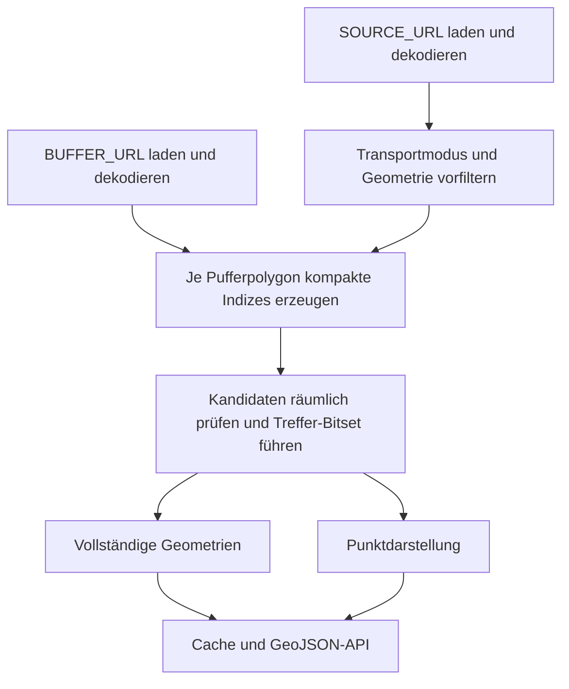

# uMap GeoJSON Spatial Filter Proxy

Aktueller Stand: **Version 1.5.1**

Ein einzelnes PHP-Skript, das zwei entfernte GeoJSON-Datensätze verarbeitet:

1. einen Quelldatensatz mit allen GeoJSON-Features und
2. einen Pufferdatensatz mit bereits vorberechneten `Polygon`- oder `MultiPolygon`-Geometrien.

Das Skript behält nur jene Features des Quelldatensatzes, die mindestens eine Pufferregion räumlich berühren oder überschneiden. Das fertig gefilterte Ergebnis wird auf dem Webspace in zwei Varianten zwischengespeichert: mit den vollständigen Originalgeometrien und als Punktdatensatz mit einem repräsentativen Schwerpunkt je Feature. Beide Varianten werden als unkomprimiertes GeoJSON an uMap oder einen anderen Client ausgeliefert.

Die räumliche Filterung läuft vollständig in PHP. Es werden weder eine Datenbank noch GEOS, GDAL oder andere externe GIS-Werkzeuge benötigt.

Die speicheroptimierte Version verwendet zwei kompakte räumliche Indizes:

- einen gleichmäßigen Rasterindex für die Kanten der Pufferpolygone und
- einen Y-Bucket-Index für Punkt-in-Polygon-Prüfungen.

Segmentkoordinaten und Indexreferenzen liegen in binären Strings statt in
großen, verschachtelten PHP-Arrays. Die Pufferpolygone werden einzeln
vorbereitet, gegen alle noch nicht zugeordneten Quell-Features geprüft und
anschließend wieder aus dem Speicher entfernt. Dadurch bleiben sowohl die Zahl
der Segmentvergleiche als auch der Speicherbedarf beherrschbar.

Wenn kein Feature beide Filter passiert, liefert die API kein nacktes JSON-Array
`[]`, sondern die für uMap geeignete leere GeoJSON-Struktur:

```json
{"type":"FeatureCollection","features":[]}
```

## Dateien

```text
geojson-proxy.php     PHP-Proxy, Attribut- und räumlicher Filter
test_php_proxy.py     Integrationstest
README.md             diese Dokumentation
```

Die PHP-Datei kann für den produktiven Einsatz auch in `geojson-proxy.php` umbenannt werden.

## Funktionsweise



Die aufwendige Verarbeitung findet nur beim Neuaufbau des Caches statt. Dabei werden beide GeoJSON-Varianten gemeinsam erzeugt. Während der konfigurierten Cache-Laufzeit werden `data.geojson` oder `points.geojson` direkt ausgeliefert, ohne die Upstream-Daten erneut abzurufen oder die Punktgeometrien bei jedem Request neu zu berechnen.

## Voraussetzungen

Für den Betrieb:

- PHP 8.0 oder neuer
- PHP-zlib mit `gzdecode()` für gzip-Dateien
- entweder PHP-cURL oder aktiviertes `allow_url_fopen`
- Schreibrechte für das Cache-Verzeichnis
- ausgehender HTTP- oder HTTPS-Zugriff auf beide Quelldateien

Für die Tests zusätzlich:

- Python 3.10 oder neuer
- das PHP-Kommandozeilenprogramm einschließlich des eingebauten PHP-Webservers

Version 1.5 ist ausdrücklich für Webspaces mit einem festen
`memory_limit` von beispielsweise 256 MiB ausgelegt: Die räumlichen Indizes
verwenden gepackte Binärdaten und werden polygonweise wieder freigegeben.
Trotzdem hängt der tatsächliche Spitzenverbrauch stärker von der Anzahl und
Komplexität der Features und Koordinaten als von der reinen Dateigröße ab, da
die dekodierten PHP-Arrays deutlich mehr Speicher als der JSON-Text benötigen.
Ein etwa 6 MiB großer **entpackter** Quelldatensatz ist daher nur ein
Anhaltspunkt und keine verlässliche Speicherprognose.

## Installation

1. `geojson-proxy.php` auf den Webspace kopieren.
2. Die Konstanten am Anfang der Datei anpassen.
3. Sicherstellen, dass PHP das konfigurierte Cache-Verzeichnis anlegen oder beschreiben darf.
4. Das Skript einmal im Browser oder mit `--warm-cache` aufrufen.
5. Die URL des PHP-Skripts in uMap als externen GeoJSON-Layer eintragen.

Eine mögliche Verzeichnisstruktur:

```text
public_html/
├── geojson-proxy.php
└── cache/
    ├── data.geojson
    ├── points.geojson
    ├── meta.json
    ├── proxy.log
    ├── refresh.lock
    └── status.json
```

Das Cache-Verzeichnis wird automatisch erzeugt, sofern das übergeordnete Verzeichnis beschreibbar ist.

## Konfiguration

Alle veränderbaren Einstellungen befinden sich am Anfang der PHP-Datei.

### Quellen und Cache

```php
const VERSION = '1.5.1';

const SOURCE_URL = 'https://example.org/source.geojson.gz';
const BUFFER_URL = 'https://example.org/buffer.geojson.gz';

const TRANSPORT_MODE_PROPERTY = 'affected-transportmode-types';
const ALLOWED_TRANSPORT_MODE_TYPES = [];

const CACHE_DIR = __DIR__ . '/cache';
const CACHE_TTL = '15m';
const STALE_TTL = '24h';

const MAX_BYTES = 32 * 1024 * 1024;
const HTTP_TIMEOUT = 60;
const USER_AGENT = 'umap-geojson-spatial-filter/' . VERSION;
```

| Konstante | Bedeutung |
|---|---|
| `VERSION` | Skriptversion und Bestandteil der Cache-Identität. |
| `SOURCE_URL` | URL der GeoJSON-`FeatureCollection`, aus der Features gefiltert werden. |
| `BUFFER_URL` | URL eines GeoJSON-Dokuments mit einem oder mehreren `Polygon`- beziehungsweise `MultiPolygon`-Puffern. |
| `TRANSPORT_MODE_PROPERTY` | Name der Feature-Property, welche die Liste der Verkehrsmitteltypen enthält. |
| `ALLOWED_TRANSPORT_MODE_TYPES` | Erlaubte Werte. Mindestens ein Wert muss im Feature vorkommen. Das leere Standardarray deaktiviert den Attributfilter. Der Vergleich ist exakt und case-sensitive. |
| `CACHE_DIR` | Lokales, durch PHP beschreibbares Cache-Verzeichnis. |
| `CACHE_TTL` | Zeitraum, in dem das gefilterte Ergebnis als frisch gilt. |
| `STALE_TTL` | Zusätzlicher Zeitraum, in dem ein abgelaufener Cache bei Refresh-Fehlern ausgeliefert werden darf. |
| `MAX_BYTES` | Höchstgröße je heruntergeladenem Dokument, je entpacktem Dokument und je gefilterter Ergebnisdarstellung. |
| `HTTP_TIMEOUT` | Zeitlimit pro Upstream-Abruf in Sekunden. |
| `USER_AGENT` | HTTP-User-Agent für beide Gegenstellen. |
| `GEO_EPSILON` | Numerische Toleranz der Geometrieprüfungen. Normalerweise nicht ändern. |

Unterstützte Zeitangaben:

```text
30s
5m
1h
24h
1d
```

Eine reine Ganzzahl wird als Anzahl Sekunden interpretiert.

### Logging und Status

```php
const DEBUG_LOG_ENABLED = true;
const DEBUG_LOG_FILENAME = 'proxy.log';
const STATUS_FILENAME = 'status.json';
const STATUS_ENDPOINT_ENABLED = true;
const LOG_PROGRESS_EVERY = 1000;
```

| Konstante | Bedeutung |
|---|---|
| `DEBUG_LOG_ENABLED` | Schreibt detaillierte JSON-Lines-Einträge nach `cache/proxy.log`. |
| `DEBUG_LOG_FILENAME` | Name der Logdatei im Cache-Verzeichnis. |
| `STATUS_FILENAME` | Name der Datei mit dem jeweils letzten Verarbeitungsstatus. |
| `STATUS_ENDPOINT_ENABLED` | Aktiviert den Diagnose-Endpunkt `?status=1`. |
| `LOG_PROGRESS_EVERY` | Kompatibilitätsoption für featurebezogene Fortschrittsmeldungen. Die aktuelle polygonweise Filterstufe schreibt ihren Fortschritt nach jedem Pufferpolygon; dieser Takt wird von der Konstante nicht verändert. |

Im stabilen Betrieb kann das detaillierte Logging mit
`DEBUG_LOG_ENABLED = false` abgeschaltet werden. Dann werden auch die
Statusdatei und der Fortschritt des Status-Endpunkts nicht aktualisiert.

### Räumliche Indexe

```php
const PACKED_SEGMENT_BYTES = 32;
const PACKED_ID_BYTES = 4;

const SPATIAL_INDEX_TARGET_SEGMENTS_PER_CELL = 24;
const SPATIAL_INDEX_MAX_TOTAL_CELLS = 16384;
const SPATIAL_INDEX_MAX_GRID_DIMENSION = 128;
const SPATIAL_INDEX_MAX_CELLS_PER_SEGMENT = 128;
const SPATIAL_INDEX_MAX_REFERENCE_BYTES = 16 * 1024 * 1024;

const POINT_INDEX_TARGET_EDGES_PER_BUCKET = 32;
const POINT_INDEX_MAX_BUCKETS = 256;
const POINT_INDEX_MAX_BUCKETS_PER_EDGE = 32;
const POINT_INDEX_MAX_REFERENCE_BYTES = 8 * 1024 * 1024;

const COMPACT_SEGMENT_MAX_BYTES = 64 * 1024 * 1024;
const MEMORY_SAFETY_RESERVE_BYTES = 32 * 1024 * 1024;
```

Diese Werte beschreiben das kompakte Speicherformat sowie die Schutz- und
Tuningparameter der beiden Indizes:

| Konstante | Bedeutung |
|---|---|
| `PACKED_SEGMENT_BYTES` | Speicher je Puffersegment: vier gepackte `double`-Werte für Start- und Endkoordinate. |
| `PACKED_ID_BYTES` | Speicher je Segmentreferenz in einem Index: eine gepackte 32-Bit-ID. |
| `SPATIAL_INDEX_TARGET_SEGMENTS_PER_CELL` | Angestrebte durchschnittliche Anzahl Puffersegmente pro Rasterzelle. Kleinere Werte erzeugen mehr Zellen und weniger Kandidaten pro Suche. |
| `SPATIAL_INDEX_MAX_TOTAL_CELLS` | Obergrenze für die theoretische Gesamtzahl der Rasterzellen. |
| `SPATIAL_INDEX_MAX_GRID_DIMENSION` | Maximale Anzahl Spalten beziehungsweise Zeilen des Rasters. |
| `SPATIAL_INDEX_MAX_CELLS_PER_SEGMENT` | Sehr lange Puffersegmente werden nicht in unbegrenzt viele Zellen eingetragen. |
| `SPATIAL_INDEX_MAX_REFERENCE_BYTES` | Speicherbudget für Referenzen des Rasterindex eines einzelnen Pufferpolygons. |
| `POINT_INDEX_TARGET_EDGES_PER_BUCKET` | Angestrebte Anzahl Polygonkanten pro Y-Bucket. |
| `POINT_INDEX_MAX_BUCKETS` | Maximale Zahl der Y-Buckets pro Polygonring. |
| `POINT_INDEX_MAX_BUCKETS_PER_EDGE` | Obergrenze für die Zahl der Buckets, in die eine einzelne Kante eingetragen wird. |
| `POINT_INDEX_MAX_REFERENCE_BYTES` | Speicherbudget für Referenzen der Punkt-in-Polygon-Indizes eines einzelnen Pufferpolygons. |
| `COMPACT_SEGMENT_MAX_BYTES` | Maximale Größe des gepackten Segmentbestands eines einzelnen Pufferpolygons. |
| `MEMORY_SAFETY_RESERVE_BYTES` | Mindestreserve, die nach dem Aufbau eines kompakten Polygonindex unterhalb des PHP-`memory_limit` verbleiben soll. |

Lange Segmente, die zu viele Rasterzellen oder Y-Buckets überspannen würden,
landen in einer kompakten Overflow-Liste. Reicht ein Referenzbudget nicht aus,
reduziert das Skript zunächst die Zahl der Zellen beziehungsweise Buckets. Ist
selbst der kleinste mögliche Index zu groß, wird kontrolliert mit einer
Fehlermeldung abgebrochen, bevor der PHP-Prozess das gesamte Speicherlimit
verbraucht.

Die Standardwerte sollten zunächst unverändert bleiben. Eine Änderung ist nur
sinnvoll, wenn reale Laufzeit- und Speicherwerte aus `proxy.log` vorliegen.

## Anforderungen an die GeoJSON-Daten

### Quelldatensatz

Der Quelldatensatz muss eine GeoJSON-`FeatureCollection` sein:

```json
{
  "type": "FeatureCollection",
  "features": [
    {
      "type": "Feature",
      "properties": {
        "name": "Beispiel"
      },
      "geometry": {
        "type": "Point",
        "coordinates": [14.2858, 48.3069]
      }
    }
  ]
}
```

Unterstützte Geometrietypen der Quell-Features:

- `Point`
- `MultiPoint`
- `LineString`
- `MultiLineString`
- `Polygon`
- `MultiPolygon`
- `GeometryCollection`

Features ohne gültiges Geometrieobjekt werden nicht übernommen. Bei einem
nicht leeren Ergebnis bleiben Properties, Feature-IDs und fremde Mitglieder
der ursprünglichen `FeatureCollection` erhalten. Eine vorhandene globale
`bbox` wird entfernt, weil sie nach dem Filtern nicht mehr stimmen muss.

Bleibt kein Feature übrig, wird bewusst nur die kanonische, minimale
FeatureCollection ausgegeben:

```json
{"type":"FeatureCollection","features":[]}
```

Dadurch erhält uMap immer ein GeoJSON-Objekt und niemals ein nacktes `[]`.
Collection-weite Metadaten des Quelldokuments werden in diesem Nulltreffer-Fall
nicht übernommen.

### Zusätzlicher Transportmittel-Filter

Optional kann vor der räumlichen Prüfung nach der Feature-Property
`affected-transportmode-types` gefiltert werden:

```json
{
  "type": "Feature",
  "properties": {
    "affected-transportmode-types": ["bus", "tram"]
  },
  "geometry": {
    "type": "Point",
    "coordinates": [14.2858, 48.3069]
  }
}
```

Die erlaubten Werte werden am Anfang der PHP-Datei konfiguriert:

```php
const TRANSPORT_MODE_PROPERTY = 'affected-transportmode-types';
const ALLOWED_TRANSPORT_MODE_TYPES = ['bus', 'train'];
```

Die Semantik ist **ODER**: Das Feature wird für die anschließende räumliche
Prüfung zugelassen, sobald mindestens einer seiner Werte in der Allow-List
vorkommt. Im Beispiel treffen daher sowohl `['bus']` als auch
`['tram', 'train']` zu.

Der Vergleich ist exakt und unterscheidet Groß- und Kleinschreibung. `bus` und
`BUS` sind daher unterschiedliche Werte. Fehlt die Property, ist sie `null`
oder enthält sie keinen passenden String, wird das Feature verworfen.

Ein einzelner String wird aus Robustheitsgründen ebenfalls akzeptiert. Die
bevorzugte Datenform bleibt jedoch eine Liste von Strings.

Mit einer leeren Allow-List wird dieser Filter vollständig deaktiviert:

```php
const ALLOWED_TRANSPORT_MODE_TYPES = [];
```

Die Attributprüfung findet **vor** der Geometrieprüfung statt. Nicht passende
Features verursachen daher keine räumlichen Berechnungen.

### Pufferdatensatz

Der Pufferdatensatz kann eines der folgenden GeoJSON-Objekte sein:

- eine direkte `Polygon`- oder `MultiPolygon`-Geometrie
- ein `Feature`
- eine `FeatureCollection`
- eine `GeometryCollection`

`Polygon`- und `MultiPolygon`-Geometrien dürfen darin beliebig verschachtelt vorkommen. Andere Geometrietypen werden ignoriert. Enthält der Datensatz kein gültiges Polygon, schlägt der Cache-Aufbau fehl.

### Kompression

Beide Antworten dürfen entweder:

- plain GeoJSON oder
- echte gzip-Daten

enthalten. Gzip wird anhand der Magic Bytes im Response-Body erkannt. Die Dateiendung und der `Content-Type` sind dafür nicht entscheidend.

### Koordinatensystem

Beide Datensätze müssen dasselbe Koordinatensystem und dieselbe Achsenreihenfolge verwenden. Das Skript führt keine Transformation durch.

Bei üblichen GeoJSON-Dateien lautet die Koordinatenreihenfolge:

```text
[Längengrad, Breitengrad]
```

Beispiel:

```json
[14.2858, 48.3069]
```

Die Implementierung berechnet keine Distanz und keinen Puffer. Der Puffer muss bereits als Polygon vorliegen.

## Räumliche Filterung

Ein Quell-Feature wird übernommen, sobald irgendein Teil seiner Geometrie mindestens einen Puffer schneidet, berührt oder innerhalb davon liegt.

Berücksichtigt werden unter anderem:

- Punkte innerhalb eines Polygons
- Punkte auf dessen Außenrand
- Linien, die einen Polygonrand kreuzen
- Linien, die vollständig innerhalb eines Polygons liegen
- Polygone, die einen Puffer überlappen
- Polygone, die vollständig innerhalb eines Puffers liegen
- Polygone, die einen Puffer vollständig umschließen
- Innenringe beziehungsweise Löcher von Polygonen
- einzelne treffende Bestandteile von Multi-Geometrien und `GeometryCollection`

### Punktdarstellung für Symbole

Ohne Parameter liefert der Proxy weiterhin die vollständig gefilterten Geometrien. Mit folgendem Parameter wird dieselbe FeatureCollection als Punktdatensatz ausgeliefert:

```text
?geometry=point
```

`?geometry=centroid` ist als gleichbedeutender Alias verfügbar. `?geometry=full` erzwingt ausdrücklich die Standarddarstellung.

Bei jedem Feature werden `id`, `properties` und sonstige fremde Feature-Mitglieder beibehalten; nur `geometry` wird durch eine `Point`-Geometrie ersetzt. Eine eventuell vorhandene Feature-`bbox` wird entfernt.

Die Punktkoordinate wird abhängig vom Geometrietyp berechnet:

- `Point`: unveränderte Koordinate
- `MultiPoint`: arithmetischer Mittelwert der Punkte
- `LineString` und `MultiLineString`: nach Segmentlänge gewichteter Linienschwerpunkt
- `Polygon` und `MultiPolygon`: nach Fläche gewichteter Flächenschwerpunkt; Innenringe werden abgezogen
- `GeometryCollection`: Schwerpunkt der enthaltenen Geometrien mit der höchsten vorhandenen Dimension

Bei degenerierten Flächen wird, soweit möglich, auf Linien- beziehungsweise Punktanteile zurückgefallen. Features, für die überhaupt keine gültige Punktkoordinate ermittelt werden kann, werden nur aus der Punktdarstellung ausgelassen; die vollständige Darstellung bleibt davon unberührt.

Die Berechnung erfolgt direkt im Koordinatenraum der Eingabedaten. Bei gewöhnlichem GeoJSON mit Längen- und Breitengraden ist dies somit ein planarer Schwerpunkt in Grad und kein geodätischer Schwerpunkt auf dem Erdellipsoid. Für einen regional begrenzten Datensatz wie Österreich ist das für die Symbolpositionierung in der Regel ausreichend.

Ein geometrischer Schwerpunkt muss bei stark konkaven Polygonen oder Polygonen mit Löchern nicht zwingend innerhalb der sichtbaren Fläche liegen. Für eine garantiert innenliegende Beschriftungsposition wäre ein eigener „point on surface“- beziehungsweise Polylabel-Algorithmus erforderlich.

### Algorithmische Optimierung

Die ursprüngliche naive Prüfung hätte im ungünstigen Fall jedes Quellsegment mit jedem Puffersegment verglichen. Bei komplexen Polygonen führt das zu annähernd quadratischem Aufwand.

Version 1.5 arbeitet in mehreren Stufen:

1. **Attributfilter in-place:** Nicht passende Verkehrsmitteltypen und Features
   ohne gültiges Geometrieobjekt werden vor dem Laden des Puffers aus dem
   Source-Array entfernt.
2. **Feature-Bounding-Boxes:** Für die verbliebenen Kandidaten wird jeweils nur
   eine Bounding Box vorgehalten.
3. **Treffer-Bitset:** Bereits getroffene Features werden in einem binären
   Bitset mit einem Bit pro Kandidat vermerkt, statt in einem großen
   assoziativen PHP-Array.
4. **Puffer polygonweise verarbeiten:** Es befindet sich immer nur der kompakte
   Index eines Pufferpolygons im Speicher. Nach dessen Prüfung wird er
   freigegeben, bevor das nächste Polygon vorbereitet wird.
5. **Gepackter Segmentbestand:** Jede Kante wird einmal als vier
   `double`-Werte in einem binären String gespeichert. Raster und Y-Buckets
   referenzieren diese Segmente über gepackte 32-Bit-IDs.
6. **Bounding-Box-Prüfung:** Ein Feature wird nur dann geometrisch gegen das
   aktuelle Pufferpolygon geprüft, wenn sich die beiden Bounding Boxes
   überschneiden.
7. **Rasterindex für Puffergrenzen:** Ein Quellsegment wird nur mit
   Puffersegmenten aus den berührten Rasterzellen und einer kleinen
   Overflow-Liste verglichen.
8. **Y-Bucket-Index:** Punkt-in-Polygon-Prüfungen berücksichtigen nur Kanten,
   deren Y-Ausdehnung zur Höhe des Prüfpunkts passt.
9. **Rekursive Geometrieprüfung:** Multi-Geometrien und
   `GeometryCollection` werden direkt durchlaufen und nicht zuerst in große
   Zwischenlisten abgeflacht.
10. **Kompaktierung in-place:** Nach der letzten räumlichen Prüfung wird das
    bestehende Feature-Array ohne zweite vollständige Ergebnisliste
    zusammengezogen.

Der Index eines einzelnen Pufferpolygons wird für alle noch nicht getroffenen
Quell-Features wiederverwendet. Danach werden sowohl der Index als auch die
ursprünglichen Koordinaten dieses Polygons freigegeben. Diese Architektur ist
der wesentliche Unterschied zur älteren Variante, die mehrere große
Indexstrukturen gleichzeitig im Speicher hielt.

## Cache-Verhalten

Der Cache besteht aus:

```text
cache/data.geojson   fertig gefiltertes Ergebnis mit vollständigen Geometrien
cache/points.geojson Punktdarstellung desselben Ergebnisses
cache/meta.json      beide ETags, Cache-Identität und Zeitangaben
cache/refresh.lock   Sperrdatei für parallele Aktualisierungen
cache/proxy.log      fortlaufendes Diagnoseprotokoll
cache/status.json    zuletzt gemeldeter Bearbeitungsstatus
```

### Frischer Cache

Solange `CACHE_TTL` nicht abgelaufen ist, werden je nach Request direkt `data.geojson` oder `points.geojson` gelesen. Quell- und Puffer-URL werden nicht erneut aufgerufen.

```text
X-Cache: HIT
```

### Erfolgreicher Neuaufbau

Nach Ablauf der TTL lädt das Skript beide Dateien, entpackt sie gegebenenfalls,
filtert den Quelldatensatz polygonweise und erzeugt daraus die vollständige
sowie die punktförmige Darstellung. Beide Ergebnisse und die Metadaten werden
zuerst in temporäre Dateien geschrieben. `meta.json` wird zuletzt aktiviert,
sodass unvollständige oder nicht zusammenpassende Cache-Dateien beim nächsten
Lesen verworfen werden.

```text
X-Cache: MISS
```

### Fehler beim Neuaufbau

Ist ein alter Cache vorhanden und befindet er sich noch innerhalb von `STALE_TTL`, wird weiterhin das zuletzt erfolgreich erzeugte Ergebnis ausgeliefert.

```text
X-Cache: STALE
Warning: 110 - "Response is stale because source refresh failed"
Cache-Control: public, max-age=0, must-revalidate
```

Ohne verwendbaren alten Cache antwortet das Skript mit HTTP 502 und einem JSON-Fehlerobjekt.

### Parallele Aufrufe

`refresh.lock` und `flock()` verhindern, dass mehrere gleichzeitige uMap-Anfragen denselben Cache parallel neu berechnen. Ein wartender Request prüft den Cache nach Erhalt des Locks erneut.

### Cache-Identität

Die Cache-Metadaten berücksichtigen:

- die Skriptversion
- `SOURCE_URL`
- `BUFFER_URL`
- `TRANSPORT_MODE_PROPERTY`
- die normalisierte Liste `ALLOWED_TRANSPORT_MODE_TYPES`

Werden eine URL, die Allow-List oder `VERSION` geändert, wird ein alter Cache nicht als passender Cache akzeptiert.

Beim Upgrade auf 1.5.1 ist daher kein manuelles Löschen eines früheren
Nulltreffer-Caches erforderlich: Die geänderte Version erzwingt automatisch
einen Neuaufbau, bevor wieder Daten ausgeliefert werden.

## Verwendung im Browser und in uMap

Vollständige gefilterte Geometrien:

```text
https://your-domain.example/geojson-proxy.php
```

Punktdarstellung für einen separaten Symbol-Layer:

```text
https://your-domain.example/geojson-proxy.php?geometry=point
```

In uMap können damit zwei externe Layer auf denselben Proxy zeigen:

```text
Geometrie-Layer:
URL:    https://your-domain.example/geojson-proxy.php
Format: GeoJSON

Symbol-Layer:
URL:    https://your-domain.example/geojson-proxy.php?geometry=point
Format: GeoJSON
```

Für jedes Feature, für das eine gültige Punktkoordinate berechnet werden kann,
enthält der Punkt-Layer dieselbe Feature-ID und dieselben Properties wie der
Geometrie-Layer. Dadurch können in uMap für Flächen beziehungsweise Linien und
für Symbole dieselben datenabhängigen Darstellungsregeln verwendet werden.
Degenerierte Features ohne ermittelbare Punktkoordinate fehlen ausschließlich
im Punkt-Layer.

Das Ergebnis wird mit folgendem Content-Type ausgeliefert:

```text
application/geo+json; charset=utf-8
```

CORS ist für alle Ursprünge aktiviert:

```text
Access-Control-Allow-Origin: *
```

Unterstützte HTTP-Methoden:

- `GET`
- `HEAD`
- `OPTIONS`

Andere Methoden erhalten HTTP 405. Ein unbekannter Wert für `geometry` erhält HTTP 400, damit Tippfehler nicht unbemerkt die falsche Darstellung liefern.

## Status und Logging

### Status-Endpunkt

Der normale Endpunkt gibt erst nach Abschluss des Cache-Aufbaus GeoJSON aus. Der Fortschritt kann parallel über folgenden Endpunkt abgefragt werden:

```text
https://your-domain.example/geojson-proxy.php?status=1
```

Beispiel:

```json
{
  "status_available": true,
  "current": {
    "stage": "filtering",
    "updated_at": "2026-07-26T18:45:20+00:00",
    "elapsed_seconds": 1.42,
    "memory_mib": 38,
    "peak_memory_mib": 44,
    "processed_buffer_polygons": 3,
    "input_buffer_polygons": 6,
    "candidate_features": 812,
    "retained_features_so_far": 246,
    "buffer_segments_so_far": 9321,
    "current_polygon_segments": 3142,
    "current_boundary_grid_cells": 132,
    "current_point_index_reference_bytes": 50272,
    "current_grid_index_reference_bytes": 48160,
    "current_compact_index_bytes": 198976,
    "percent": 50
  },
  "cache": {
    "data_exists": false,
    "meta_exists": false,
    "metadata": null
  },
  "log_file": "proxy.log"
}
```

Mögliche Verarbeitungsstufen sind unter anderem:

```text
request-start
serving-fresh-cache
waiting-for-refresh-lock
refresh-lock-acquired
refresh-started
downloading-source
source-decoded
filtering-transport-modes
transport-mode-filter-complete
downloading-buffer
buffer-decoded
spatial-filter-start
preparing-buffer-polygons
filtering
spatial-filter-complete
encoding-full-result
building-point-representation
encoding-point-result
ready-to-cache
writing-cache
refresh-complete
refresh-failed
fatal-error
```

### Logdatei

`cache/proxy.log` verwendet das JSON-Lines-Format: Jede Zeile ist ein vollständiges JSON-Objekt.

Live beobachten:

```bash
tail -f cache/proxy.log
```

Ein relevanter Eintrag nach der Verarbeitung eines Pufferpolygons sieht
beispielsweise so aus:

```json
{
  "level": "INFO",
  "message": "buffer polygon processed with compact spatial indexes",
  "processed_buffer_polygons": 3,
  "input_buffer_polygons": 6,
  "candidate_features": 812,
  "retained_features_so_far": 246,
  "current_polygon_segments": 3142,
  "current_boundary_grid_cells": 132,
  "current_point_index_reference_bytes": 50272,
  "current_grid_index_reference_bytes": 48160,
  "current_compact_index_bytes": 198976,
  "percent": 50
}
```

Diese Werte helfen bei der Beurteilung, ob ein einzelnes Pufferpolygon
ungewöhnlich viele Segmente oder Indexreferenzen benötigt. Weil immer nur der
aktuelle kompakte Polygonindex gehalten wird, ist
`current_compact_index_bytes` für die Speicherdiagnose aussagekräftiger als
eine aufsummierte Segmentzahl.

## HTTP-Caching

Das Skript erzeugt für die vollständige und die punktförmige Darstellung jeweils einen eigenen SHA-256-basierten `ETag`. Clients können den zur angefragten URL gehörenden Wert über `If-None-Match` zurücksenden. Ist diese Darstellung unverändert, antwortet der Proxy mit HTTP 304 und ohne Body.

Zusätzliche Header:

```text
ETag: "..."
X-Cache: HIT | MISS | STALE
X-Geometry-Mode: full | point
X-Cache-Fetched-At: 2026-07-12T12:00:00+00:00
Age: 42
```

## Kommandozeilenverwendung

Hilfe anzeigen:

```bash
php geojson-proxy.php --help
```

Version anzeigen:

```bash
php geojson-proxy.php --version
```

Cache unabhängig von seiner aktuellen Gültigkeit neu aufbauen:

```bash
php geojson-proxy.php --warm-cache
```

Beispielausgabe:

```text
cache refreshed
etag: "..."
bytes: 123456
point_etag: "..."
point_bytes: 45678
expires_at: 2026-07-12T12:15:00+00:00
stale_until: 2026-07-13T12:15:00+00:00
peak_memory_mib: 38.00
```

Der Warm-Cache-Aufruf eignet sich auch für einen Cronjob, damit die Aktualisierung nicht durch den ersten uMap-Aufruf nach Ablauf der TTL ausgelöst werden muss.

```cron
*/15 * * * * /usr/bin/php /pfad/zu/geojson-proxy.php --warm-cache >/dev/null 2>&1
```

## Tests

`test_php_proxy.py` ist ein Integrationstest. Er startet:

1. einen lokalen Python-HTTP-Server als simulierte Quell- und Puffergegenstelle,
2. den eingebauten PHP-Webserver mit einer temporären Kopie des Skripts und
3. echte HTTP-Anfragen gegen den Proxy.

Die originale PHP-Datei wird nicht verändert. Der Test ersetzt nur in einer temporären Kopie die Konfigurationskonstanten und verwendet ein temporäres Cache-Verzeichnis.

Die Tests benötigen keinen Internetzugriff.

### Test ausführen

```bash
python3 test_php_proxy.py ./geojson-proxy.php
```

Alternativ:

```bash
chmod +x test_php_proxy.py
./test_php_proxy.py ./geojson-proxy.php
```

Ein anderes PHP-Binary verwenden:

```bash
python3 test_php_proxy.py ./geojson-proxy.php \
  --php-bin /usr/local/bin/php
```

PHP-Serverlog nach dem Test anzeigen:

```bash
python3 test_php_proxy.py ./geojson-proxy.php \
  --show-php-log
```

### Abgedeckte Testfälle

Der Test führt die Gruppen `Test 0` bis `Test 12` aus:

0. Syntaxprüfung der temporär konfigurierten PHP-Datei mit `php -l`
1. Abruf und Dekomprimierung beider gzip-Dateien sowie räumliche Filterung aller unterstützten Geometrietypen
1b. Punktdarstellung mit identischen Feature-IDs und Properties sowie typgerechten Schwerpunktberechnungen
2. erneuter Aufruf beider Darstellungen aus dem fertigen Cache ohne weitere Upstream-Anfragen
3. getrennte ETags, `If-None-Match` und HTTP 304 für vollständige und punktförmige Darstellung
4. `HEAD` mit darstellungsspezifischen Headern und ohne Body
5. `OPTIONS`, CORS, HTTP 405 sowie HTTP 400 bei ungültigem `geometry`-Parameter
6. geänderter Puffer wird erst nach Ablauf der TTL berücksichtigt
7. Ausfall der Quell-URL führt zur Auslieferung des alten Caches als `STALE`
8. Ausfall der Puffer-URL führt ebenfalls zur Auslieferung des alten Caches
9. erfolgreiche Erholung sowie erzwungener Neuaufbau mit `--warm-cache`
10. ein Pufferdatensatz ohne Polygon führt ohne alten Cache zu HTTP 502; der
    Test akzeptiert beide gleichwertigen Detailmeldungen mit und ohne
    `valid`
11. erster Request direkt im Punktmodus sowie ODER-Filterung nach `affected-transportmode-types`, einschließlich fehlender Property und case-sensitive Matching
12. Änderung der Allow-List invalidiert einen ansonsten frischen Cache

Die Geometrietests enthalten unter anderem:

- Treffer und Nicht-Treffer für alle unterstützten Quellgeometrien
- mehrere Pufferpolygone
- `MultiPolygon` innerhalb einer `GeometryCollection`
- Punkte auf dem Außenrand
- Punkte auf dem Rand eines Polygonlochs
- Punkte und Geometrien vollständig in einem Loch
- kreuzende Linien
- überlappende und umschließende Polygone
- Erhalt ursprünglicher Properties und fremder Collection-Mitglieder
- Entfernung einer nach dem Filtern ungültigen globalen `bbox`
- Kontrolle, dass im Cache sowohl die vollständige als auch die punktförmige Darstellung liegt
- Flächenmittelpunkt mit Innenring, längengewichteter Linienmittelpunkt und dimensionsgerechte `GeometryCollection`

Erfolgreicher Abschluss:

```text
All tests passed.
```

Die Tests prüfen die fachliche Korrektheit der räumlichen Filterung und des Cache-Verhaltens. Sie sind kein repräsentativer Benchmark für die Laufzeit realer, hochkomplexer Geometrien.

## Diagnose und Fehlerbehebung

### Nur `refresh.lock` wird angelegt

`refresh.lock` wird vor Download, Entpacken, Indexaufbau und Filterung erzeugt. Prüfe anschließend:

```text
cache/status.json
cache/proxy.log
```

Oder rufe parallel auf:

```text
https://your-domain.example/geojson-proxy.php?status=1
```

Damit ist erkennbar, ob der Prozess beim Lock, Download, JSON-Dekodieren, Indexaufbau oder Filtern arbeitet.

### `waiting-for-refresh-lock`

Ein anderer PHP-Prozess hält den Lock und baut vermutlich gerade den Cache auf. Prüfe `proxy.log` und den Status-Endpunkt. Eine alte leere Lockdatei ist allein kein Problem; entscheidend ist die aktive `flock()`-Sperre.

### `cache directory is not writable`

Das konfigurierte Verzeichnis ist für den PHP-Prozess nicht beschreibbar. Rechte oder Eigentümer anpassen.

### `PHP zlib support is required for gzip data`

Die PHP-zlib-Erweiterung ist nicht verfügbar. Auf einem verwalteten Webspace muss sie durch den Anbieter aktiviert sein.

### `neither curl nor allow_url_fopen is available`

PHP kann keine entfernten URLs abrufen. Entweder cURL aktivieren oder `allow_url_fopen` freischalten lassen.

### `response exceeds MAX_BYTES`

Die heruntergeladene Datei, die entpackte Datei oder das Ergebnis überschreitet `MAX_BYTES`.

Für einen 6 MiB großen entpackten Quelldatensatz ist der Standardwert von 32 MiB ein sinnvoller Ausgangspunkt:

```php
const MAX_BYTES = 32 * 1024 * 1024;
```

### `Allowed memory size ... exhausted`

Version 1.5 hält nicht mehr alle räumlichen Indizes gleichzeitig als
verschachtelte PHP-Arrays. Puffersegmente und Indexreferenzen werden kompakt
gespeichert, jedes Pufferpolygon wird einzeln verarbeitet und ein
Treffer-Bitset ersetzt eine große Trefferliste.

Ein Speicherfehler kann dennoch auftreten, insbesondere:

- beim Dekodieren eines sehr großen GeoJSON-Dokuments in PHP-Arrays,
- bei einem einzelnen außergewöhnlich komplexen Pufferpolygon,
- wenn Source- und Buffer-Dokument zusammen bereits fast das gesamte
  `memory_limit` beanspruchen oder
- beim gleichzeitigen Vorhalten der vollständigen Ergebniszeichenkette und der
  anschließend erzeugten Punktdarstellung.

Wenn das Speicherlimit nicht erhöht werden kann, sind die wirksamsten
Maßnahmen:

1. Source- und Puffer-GeoJSON upstream vereinfachen.
2. Ein sehr großes Pufferpolygon in mehrere kleinere Polygone aufteilen.
3. Nicht benötigte Source-Features bereits upstream entfernen.
4. Prüfen, ob tatsächlich Version 1.5.1 läuft:

   ```bash
   php geojson-proxy.php --version
   ```

5. Erst nach Auswertung des Logs gegebenenfalls
   `SPATIAL_INDEX_MAX_REFERENCE_BYTES` oder
   `POINT_INDEX_MAX_REFERENCE_BYTES` verkleinern. Zu kleine Budgets führen zu
   einem kontrollierten Abbruch, können aber einen unkontrollierten
   Speicherüberlauf verhindern.

Den Spitzenverbrauch zeigt der CLI-Aufruf:

```bash
php geojson-proxy.php --warm-cache
```

### Die Verarbeitung bleibt bei `preparing-buffer-polygons`

Der Aufbau des kompakten Index für das aktuelle Pufferpolygon benötigt
ungewöhnlich lange. Typische Ursachen:

- extrem viele Segmente in einem einzelnen Pufferpolygon
- sehr lange Segmente, die große Bereiche überdecken
- ungültige oder unnötig hoch aufgelöste Puffergeometrien

Prüfe `current_polygon_segments`, `current_compact_index_bytes` und die beiden
Felder `current_*_reference_bytes` im Log. Eine Vereinfachung oder Aufteilung
des betreffenden Pufferpolygons kann Laufzeit und Speicherbedarf stark
reduzieren.

### Die Verarbeitung bleibt bei `filtering`

Prüfe im Status:

- `processed_buffer_polygons`
- `input_buffer_polygons`
- `candidate_features`
- `retained_features_so_far`
- `current_polygon_segments`
- `current_compact_index_bytes`
- `percent`

Der Fortschritt wird nach jedem vollständig verarbeiteten Pufferpolygon
aktualisiert. Bleibt derselbe Wert lange stehen, ist entweder das aktuelle
Pufferpolygon oder mindestens eines der dagegen geprüften Quell-Features sehr
komplex. Dann lohnt es sich, die Koordinatenzahl dieser Geometrien gezielt zu
untersuchen.

### HTTP 502

Mindestens einer dieser Schritte ist fehlgeschlagen:

- Quell- oder Pufferdatei herunterladen
- gzip-Datei entpacken
- JSON dekodieren
- GeoJSON-Grundstruktur prüfen
- mindestens ein Pufferpolygon finden
- räumliche Indizes aufbauen
- räumlich filtern
- Ergebnis kodieren oder speichern

Die JSON-Antwort enthält im Feld `details` die konkrete Fehlermeldung. Zusätzliche Informationen stehen in `cache/proxy.log` und `cache/status.json`.

Zwei ähnlich klingende Pufferfehler bezeichnen unterschiedliche
Validierungsstufen:

| Detailmeldung | Bedeutung |
|---|---|
| `buffer GeoJSON contains no Polygon or MultiPolygon geometry` | Im Dokument wurde überhaupt keine `Polygon`- oder `MultiPolygon`-Geometrie gefunden. |
| `buffer GeoJSON contains no valid Polygon or MultiPolygon geometry` | Polygon-Koordinaten waren vorhanden, daraus ließ sich aber kein verwendbarer Ring mit Segmenten vorbereiten. |

### Leere FeatureCollection

Eine leere `features`-Liste ist kein technischer Fehler. Sie bedeutet, dass
kein Quell-Feature sowohl den optionalen Transportmodus- als auch den
räumlichen Filter passiert hat. Sowohl die vollständige als auch die
punktförmige API-Variante antworten in diesem Fall exakt mit:

```json
{"type":"FeatureCollection","features":[]}
```

Ein nacktes `[]` wird nicht ausgeliefert.

## Leistungsoptimierung

Die Standardindexwerte sind für allgemeine Daten gewählt. Vor Änderungen sollten folgende Werte aus dem Log betrachtet werden:

- `processed_buffer_polygons`
- `candidate_features`
- `current_polygon_segments`
- `current_boundary_grid_cells`
- `current_point_index_reference_bytes`
- `current_grid_index_reference_bytes`
- `current_compact_index_bytes`
- Dauer der Stufen `preparing-buffer-polygons` und `filtering`
- maximaler Speicherverbrauch

Weitere wirksame Maßnahmen:

1. Puffergeometrien vorab sinnvoll vereinfachen.
2. Unnötig dichte Quelllinien oder Polygone vereinfachen.
3. Den Cache über einen Cronjob mit `--warm-cache` erzeugen.
4. `CACHE_TTL` so wählen, dass die Neuberechnung nicht unnötig häufig erfolgt.
5. Logging nach erfolgreicher Inbetriebnahme reduzieren.

Ein kleinerer Wert für `SPATIAL_INDEX_TARGET_SEGMENTS_PER_CELL` kann die Kandidatenzahl pro Rasterzelle reduzieren, erzeugt aber mehr Indexzellen und höheren Speicherbedarf. Ein größerer Wert spart Speicher, führt aber zu mehr Segmentvergleichen. Änderungen sollten deshalb anhand realer Messwerte erfolgen.

## Grenzen

Die räumlichen Operationen sind bewusst als Pure-PHP-Lösung implementiert und ersetzen keine vollständige GIS-Engine.

Zu beachten:

- Es erfolgt keine Koordinatentransformation.
- Ungültige oder selbstüberschneidende Polygone werden nicht repariert.
- Sonderfälle am 180. Längengrad beziehungsweise Antimeridian werden nicht eigens behandelt.
- Sehr große oder extrem komplexe Geometrien können weiterhin hohe Laufzeit und hohen Speicherbedarf verursachen.
- Die Implementierung ist für topologische Überschneidungsprüfungen gedacht, nicht für exakte Distanz-, Flächen- oder Pufferberechnungen.
- Die numerische Toleranz kann robuste GEOS-Arithmetik nicht vollständig ersetzen.
- Die Punktdarstellung berechnet planare Schwerpunkte und garantiert bei konkaven Polygonen oder Löchern keinen Punkt innerhalb der Fläche.
- Der Rasterindex beschleunigt Kandidatensuchen, ändert aber nicht die geometrische Genauigkeit der anschließenden Segmenttests.

Für den beschriebenen Einsatzzweck – einen ungefähr 6 MiB großen Datensatz periodisch gegen sechs vorberechnete Pufferpolygone zu filtern und das Ergebnis aus dem Cache an uMap auszuliefern – ist die indexierte Version wesentlich besser geeignet als eine vollständige paarweise Segmentprüfung.

## Sicherheitshinweise

- Die beiden URLs sind fest in der PHP-Datei konfiguriert. Das Skript ist kein offener Proxy und nimmt keine Ziel-URL aus Benutzerparametern entgegen.
- `MAX_BYTES`, HTTP-Timeouts und eine Begrenzung der Weiterleitungen schützen vor unbegrenzt großen oder hängenden Downloads.
- Das Cache-Verzeichnis sollte möglichst nicht direkt öffentlich abrufbar sein. Der Client soll ausschließlich das PHP-Skript verwenden.
- Enthalten die URLs geheime Tokens, muss der Zugriff auf PHP-Quelldateien und Backups zuverlässig verhindert sein.
- `proxy.log` und `status.json` können Quell-URLs, Größen und Fehlermeldungen enthalten. Bei vertraulichen Daten sollte der direkte Webzugriff auf das Cache-Verzeichnis gesperrt werden.
- Der Status-Endpunkt ist für Diagnosezwecke gedacht. Falls dessen Informationen nicht öffentlich sichtbar sein sollen, `STATUS_ENDPOINT_ENABLED` nach der Inbetriebnahme auf `false` setzen.
- Da CORS mit `*` aktiviert ist, kann das gefilterte Ergebnis von beliebigen Webseiten abgerufen werden. Das ist für einen öffentlichen uMap-Layer üblich, für vertrauliche Daten aber ungeeignet.
